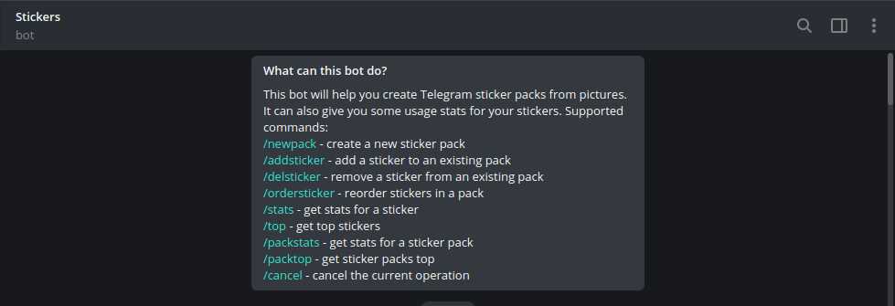

Pode parecer idiota, mas sempre quis criar *"esses"* troço. Os Stickers no Telegram são para mera diversão e dentro dos grupos faz mais sentido ainda.

Eu não sabia, mas para criar Stickers já existe um bot pronto que é recomendado pelo <a href="https://telegram.org/blog/stickers-revolution" target="_blank">próprio Telegram</a>. Para começar a criar seus bots basta inicar uma conversa com o <a href="https://telegram.me/stickers" target="_blank">@stickers</a> bot, que é um projeto Open Source e você pode acessar o código fonte aqui. Assim que iniciar uma conversa o Bot irá mostrar uma lista de instruções que você deve seguir.

    

O Bot é extremamente intuitivo e dispensa explicações. Você precisa somente fazer o que ele manda para publicar seus Stickers. Então é isso! Divirta-se!

Falows!
