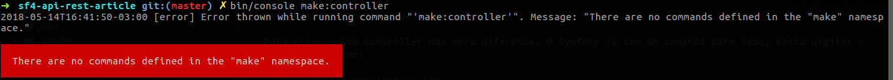
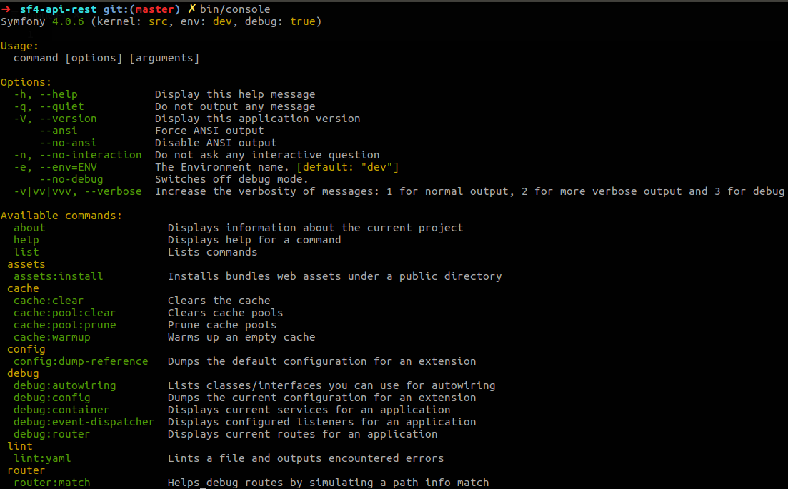
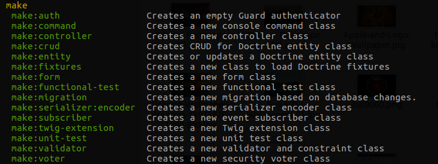
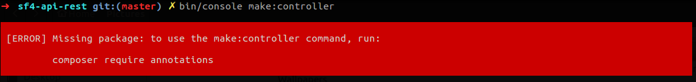
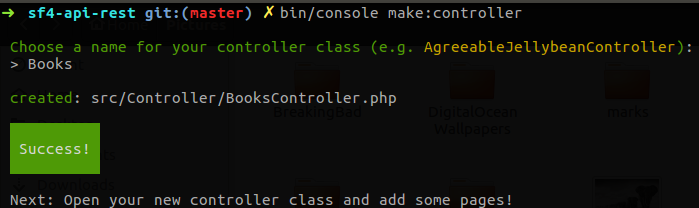

Olá. Neste artigo nós vamos falar sobre APIs com Symfony 4. A ideia aqui é mostrar como esta ferramenta pode facilitar o desenvolvimento de aplicações baseadas em APIs. Não estou dizendo que as versões anteriores ao Symfony 4 não eram tão boas, pelo contrário. Mas a versão 4 do Symfony, veio com uma nova abordagem para a contrução de aplicações e vamos tirar proveito disto. Se você nunca usou o Symfony ou não tem muita familiaridade, não se preocupe, nós vamos usar este primeiro artigo para mostrar toda a *setup* necessária para nossa aplicação.

### Setup

Obviamente você precisa ter o <a href="https://getcomposer.org/" target="_blank">composer</a> e o <a href="http://php.net/" target="_blank">PHP7.1</a> instalados na sua máquina ou configurados no seu ambiente Docker, caso esteja usando.

A versão 4 do Symfony não possui instalador, assim como suas versões anteriores. Vamos criar o nosso projeto com base em um skeleton existente utilizando o composer. Para isso utilize o seguinte comando:

```composer create-project symfony/skeleton sf4-api-rest```

Onde *sf4-api-rest* é o nome do nosso projeto criado pelo composer. Para entender sobre a estrurua de diretórios, existe um artigo do próprio criador do Symfony que você pode <a href="http://fabien.potencier.org/symfony4-directory-structure-updates.html" target="_blank">ler aqui</a>.

### Nosso projeto

Nós vamos criar um exemplo clássico: uma API de livros, utilizando os verbos HTTP para realizar as operações básicas que precisamos para manipular nossas informações. A estrutra de rotas será a seguinte:

```
Books API

GET    => /books/{id}
POST   => /books/create
PUT    => /books/update/{id}
DELETE => /books/delete/{id}
```

Esta é a estrutura inicial. Iremos refatorá-la. Então mãos a obra.

## Startando nossa aplicação

### Criando o Controller de livros

Neste exemplo tudo irá ficar no controller, apesar de ser uma má prática, o foco aqui é mostrar como utlizar o Symfony 4 como ferramenta para a criação de APIs REST. Além do mais nós realizaremos operações básicas o que não irão requerer a construção de uma estrutura mais complexa. Mas vale lembrar que colocar tudo no controller não é uma boa opção.

O Symfony nos dá muito poder com o console que possui e nós vamos nos utilizar bastante dele para criar mais rápido as coisas que iremos precisar.

Para criar nosso controller não será diferente. O Symfony já tem um comando para isso, basta digitar o seguinte comando:

```bin/console make:controller```

Você possivelmente irá receber uma mensagem de erro semelhante a esta:

<center>
    
</center>

O Symfony está nos informando que precisamos do Bundle "make" para poder criar controllers. Execute "bin/console" para ver os bundles disponíveis:

<center>
    
</center>

Realmente não temos o Make disponível. Vamos utilizar o composer para instalar essa dependência:

```composer require maker```

Um outro detalhe é que o Symfony 3.3(ou superior) e 4 utilizam o Symfony Flex uma ferramenta do Symfony que nos auxilia na instalação e remoção de dependências. Recomendo fortemente que você leia sobre o <a href="https://symfony.com/doc/current/setup/flex.html" target="_blank">Symfony Flex</a>.

Agora já temos os comandos do Make disponíveis na nossa aplicação:

<center>
    
</center>

Vamos criar nosso controller de Livros:

```bin/console make:controller```

<center>
    
</center>

A segunda exigência que o Symfony nos faz, na imagem acima, é informar que, para criar controllers ele precisa de annotations. Isso ocorre porque as annotations são a principal forma que o Symfony 4 utiliza para criar rotas. Veremos isso mais à frente. Por hora, vamos obedecer o Symfony e instalar esta dependência:

```composer require annotations```

Essa dependência faz parte do *sensio/framework-extra-bundle* que é uma Recipe do Symfony.

*As receitas do Symfony permitem a automação da configuração dos pacotes do Composer através do plugin Symfony Flex Composer.*

Recomendo fortemente que você leia sobre as Recipes na <a href="https://github.com/symfony/recipes" target="_blank">página do Github.</a>

Agora já podemos criar nosso controller. Ao fazer isso você receberá a seguinte mensagem:

<center>
    
</center>

Iremos criar nossas operações dentro deste controller.

### Configurando outras dependências

Antes de dar continuidade, vamos instalar uma depência que iremos utlizar mais a frente. Essa dependência é o ```jms/seralizer``` . Falaremos sobre serialização mais a frente, por hora instale o ```jms/seralizer``` com o seguinte comando:

```composer require jms/serializer```

## Conclusão

Com apenas algumas etapas conseguimos preparar todo ambiente de trabalho necessário para a criação da nossa API. Perfeito! Agora vamos criar as nossas rotas e operações, no próximo artigo.
